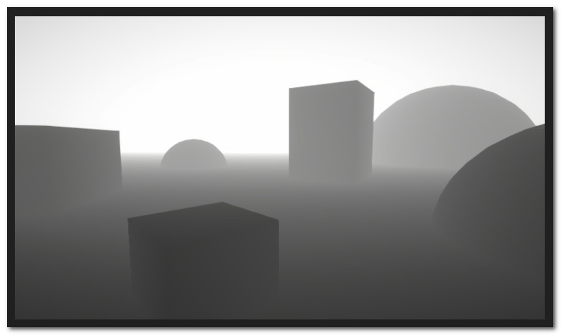
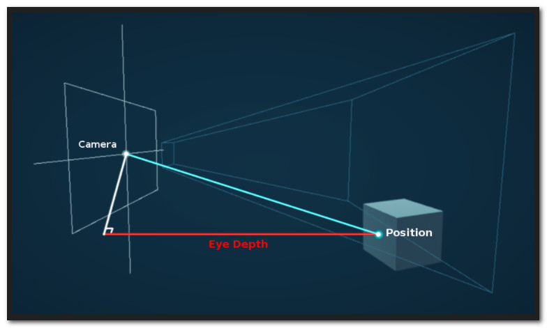
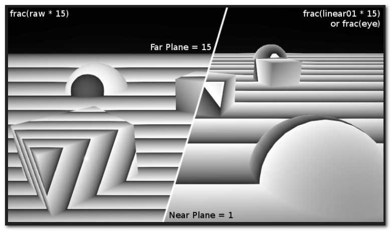

# Depth

**Depth** is a term used in computer graphics to refer to how far a fragment (a potential pixel) is from the camera . But it can be a bit complicated - as depth can come in different spaces/ranges , vary between platform , and vary between perspective and orthographic camera projections .



This post goes over everything about depth that I've come across (so you could say it's an *in-depth* post about depth!) , mainly focusing on **Unity** and the **Universal RP** (but also includes some High Definition RP stuff) . Includes info for both **ShaderGraph** and URP Shader Code (**HLSL**) .

## What is Depth ?

### View space, Eye Depth

The easiest type of depth to understand is **Eye/View-space Depth** which refers to the distance between a position in the scene to a plane perpendicular to the camera's view - (Not the camera position itself) .



During the vertex shader stage , the object space vertex positions in a mesh are converted to World space via the Model Matrix , then to **View space** via the **View Matrix** . Here in View space , positions are relative to the camera - which looks down the **negative Z axis** .

By negating the Z value of a View space position it turns it back into a positive value (assuming the object was infront of the camera) , which is the **Eye Depth** . A depth value of 0 is at the camera's position , 1 would be 1 unit away , 10 is 10 units , etc . Somewhat oddly , I've also heard this depth value referred to as "World" space Depth , likely due to World and View both using the same unit scales - but personally I'd stick to the View or Eye naming .

The ranges of this depth is the same for all platforms . It's also the same for both othrographic and perspective projections too , since view space is before the projection is applied . You do need to be careful about how the eye depth is obtained though !

For Shader Code , the first method would be the equivalent of :

```hlsl
// Vertex : (Should work in URP and HDRP)
float3 positionWS = TransformObjectToWorld(IN.positionOS.xyz);
float3 positionVS = TransformWorldToView(positionWS);
OUT.positionVS = positionVS;

// Fragment :
float fragmentEyeDepth = -IN.positionVS.z;

// Also equivalent to : (even less pipeline specific)
// Vertex :
float3 positionWS = mul(UNITY_MATRIX_M, float4(IN.positionOS.xyz, 1.0)).xyz;
float3 positionVS = mul(UNITY_MATRIX_V, float4(positionWS, 1.0)).xyz;
OUT.positionVS = positionVS;

// Fragment :
float fragmentEyeDepth = -IN.positionVS.z;

// All would require the positionVS being included in the struct passed into the fragment
// using one of the TEXCOORDX semantics , assuming you don't just want the vertex's eye 
// depth.
// Guess you also could just pass that z/depth through rather than the whole view position.
```

For obtaining the eye depth of **objects in the scene** (behind the fragment) , we would instead sample a special texture that Unity generates for us known as the **Depth Texture** (aka the *Scene Depth* node) - but more on that in the later [<u>Sampling the Depth Texture</u>](https://www.cyanilux.com/tutorials/depth/#sample-depth-texture) and [<u>Scene Depth</u>](https://www.cyanilux.com/tutorials/depth/#scene-depth-node) sections .

You will also commonly see **Linear01** depth be used , which is just a remapped version of Eye (by dividing by the far plane value) . It is still 0 at the camera position , but 1 at the far plane .

### Clip space, Normalised Device Coordinates(NDC) & Z Buffer Depth

View space positions also get converted to **Clip space** via the **Projection Matrix** . Usually transformations like this can't warp the space in a non-uniform way - which we need for a perpective projection , but the matrix is set up in a way that outputs the **Eye Depth** in the **W component** of the result . The vertex shader then outputs this Clip space position . For orthographic projections , the W component just ends up as 1 .

Between the vertex and fragment stages the clip space XYZ is **remapped** a bit and then **divided** by it's **W component** (known as the **perspective divide**) . The remapping that occurs is the same as the **ComputeScreenPos** function , or positionNDC calculated in the VertexPositionInputs struct . In URP these are both found in [<u>ShaderVariablesFunctions.hlsl</u>](https://github.com/Unity-Technologies/Graphics/blob/master/com.unity.render-pipelines.universal/ShaderLibrary/ShaderVariablesFunctions.hlsl) :

```hlsl
// Clip Space Position (calculated for vertex shader SV_POSITION output)
float4 positionCS = TransformWorldToHClip(input.positionOS.xyz);
OUT.positionCS = positionCS;

// Remap, Handled automatically for the SV_POSITION semantic .
// Note that it's w (eye depth) component remains untouched , even when passed into 
// the fragment .
// Other semantics (TEXCOORDX) passing clip space through would need to do this manually
float4 positionNDC = positionCS * 0.5f;
positionNDC.xy = float2(positionNDC.x, positionNDC.y * _ProjectionParams.x) + positionNDC.w;
positionNDC.zw = positionCS.zw;
OUT.positionNDC = positionNDC;

// or just
// OUT.positionNDC = ComputeScreenPos(positionCS);

// Perspective Divide (handled in Fragment shader)
float3 pd = IN.positionNDC.xyz / IN.positionNDC.w;
float2 screenUV = pd.xy;
float depth = pd.z;// for OpenGL, also need * 0.5 + 0.5;
```

This gives us **Normalised Device Coordinates** (NDC) , aka screen position where the **XY** axis ranges from **(0 , 0)** in the **bottom left corner** and **(1 , 1)** in the **top right** - at least in Unity / URP . This is the same as the **Screen Position** node in Shader Graph , using it's **Default** mode ... but awkwardly the Z axis doesn't seem to be passed in when that mode ? The Z axis can instead be obtained by using the **Raw** mode - but that is the Clip space Z/Depth . We then need to handle the **Divide** **Z** by **W** to get the NDC Z/Depth .

Note this depth is **not linear in view space** anymore due to changes made by the projection matrix , at least in a perspective projection . This is the value that ends up in the **Depth Buffer** and it is also the same value that would end up in the **Depth Texture** , or Raw **Screen Depth** node .

The ranges of this **NDC.z / Z Buffer Depth** is the same for both projections , but varies depending on the platform :

- Direct3D-like , Reversed Z Buffer : 1 at the near plane , 0 at the far plane
- OpenGL-like , Z Buffer : 0 at the near plane , 1 at the far plane

In case it is of interest , the ranges of the **Clip space Z (RAW Screen Position** Z) value are also as follows , though I'm unsure if there's really any case where you'd use this over the other depth values . 

**Perspective Projection** 

- Direct3D-like : near plane value at near plane , 0 at far plane
- OpenGL-like : -near plane distance at near plane , far plane distance at far plane .

**Orthographic Projection**

- Direct3D-like : 1 at near plane , 0 at far plane
- OpenGL-like : -1 at near plane , 1 at far plane

Note , I believe we could remap these for orthographic using the *`UNITY_NEAR_CLIP_VALUE`* and *`UNITY_RAW_FAR_CLIP_VALUE`* (from [<u>com.unity.render-pipelines.core/ShaderLibrary/API</u>](https://github.com/Unity-Technologies/Graphics/tree/master/com.unity.render-pipelines.core/ShaderLibrary/API)) to convert the Direct3D-like or OpenGL-like ranges into the same range 0-1 range.

## Why Non-Linear ?

The reason for making the depth buffer value non-linear (in view space) , as well as the Reversed Z Buffer for Direct3D-like platforms , is for better precision . More information about how this works can be found in this [<u>NVIDIA article</u>](https://developer.nvidia.com/content/depth-precision-visualized) and it can explain it a lot better than I can .

Here's an image to help show the comparison between this non-linear NDC / Z Buffer Depth (labelled "raw" here , as it's the raw value from the Depth Buffer and Depth Texture) , and the Linear01 or Eye depth .



On the right , is the Linear01 value multiplled by 15 (the far plane value) - which is equal to the Eye depth , put through a frac function (aka Fraction node) which makes the value repeat between 0 and 1 . Each repeating value of 0-1 on the right is 1 unit . The width of each repeating section gets smaller as it approaches the far plane .

On the left , we have the NDC Depth multiplled by 15 (far plane) and again put through a frac function . While this depth is non-linear in View space , it is actually linear in NDC/Screen space - the width of each repeating section varies based on the viewing angle , but it's always the same across the plane . I came across [<u>this article</u>]() which again confirms this and notes that it is useful for some hardware optimisations , as well as for post processing - such as comparing the depth value from neighbouring pixels for edge detection .

## Depth Buffer VS Depth Texture

### Depth Buffer , ZWrite & ZTest

In the above section I mentioned the **Depth Buffer** (also referred to as the Z Buffer) . When rendering , this buffer is essentially reponsible for sorting pixels / fragments . It ensures that objects closer to the camera will be on-top of objects that arre further away (though there are ways to override that behaviour) .

Typically only **Opaque** geometry will write to the depth buffer , controlled by [<u>ZWrite</u>](https://docs.unity3d.com/Manual/shader-shaderlab-commands.html) in the Shaderlab section of the shader code . Shader Graph will write to the buffer automatically based on the Surface mode (ZWrite On for Opaque , Off for Transparent) . If an object doesn't write to the buffer , other objects can't test against it later .

Opaque geometry gets rendered **front-to-back** , meaning objects closer to the camera get drawn **first** , writing to the camera's colour and depth buffers . When an object further away tries to render , it tests against the values in the buffer based on [<u>ZTest</u>](https://docs.unity3d.com/Manual/shader-shaderlab-commands.html) in Shaderlab code . This can't be changed in Shader Graph , but you can override the values in URP using a RenderObjects feature on the Forward Renderer .

ZTest has a default value of **LEqual** , meaning if the fragment's depth is less than , or equal to the value in the depth buffer it will render , otherwise the fragment is discarded / culled . We could instead use **ZTest Greater** , to only render an object if a closer object has already written to the buffer . e.g. In order to show a silhouette of the object when it is occluded .

By rendering opaque objects closer to the camera first , we don't have to waste computation on pixels that would be covered by other objects ... Technically , depth-testing / ZTest is actually handled **after** the fragment shader but there is also additional optimisations on GPU hardware that allow an early depth test to take place before the fragment - see the [<u>SV_Depth</u>](https://www.cyanilux.com/tutorials/depth/#sv-depth) section for more info .

But when rendering **Transparent** geometry , it instead has to render **back-to-front** and typically does not write to the depth buffer , in order to achieve the correct **alpha blending** . The objects are sorted by how close their origin is to the camera , but this can vary a bit as the camera moves , which is why sorting transparent shaders can sometimes be difficult .

### Depth Texture

Between rendering objects in these opaque and transparent queues , the Universal RP **copies** the Depth Buffer and stores it in the **Depth Texture** . I would assume something similar happens in HDRP .

This then allows **Transparent** shaders to read that texture and use it in their calculations . e.g. to create intersection effects like in the [<u>Simple Forcefield Breakdown</u>](https://www.cyanilux.com/tutorials/forcefield-shader-breakdown-simple/) or edge-foam for toon water shaders and fog effects like the [<u>Fog Plane Shader Breakdown</u>](https://www.cyanilux.com/tutorials/fog-plane-shader-breakdown/).

Note that other Transparent objects will not show on the Depth Texture , as they do not typically write to the Depth Buffer (ZWrite) and even if they did , the buffer was copied to the texture before transparent objects were even rendered .

For some platforms , they do not support copying the depth buffer - and it also can't copy if MSAA (multisample anti-aliasing) is enabled on the URP asset currently . This might change in the future though , see the "CanCopyDepth" function at the bottom of the [<u>ForwardRenderer</u>](https://github.com/Unity-Technologies/Graphics/blob/master/com.unity.render-pipelines.universal/Runtime/ForwardRenderer.cs) class .

For those cases where the copy cannot occur , a **Depth Prepass** is used instead . Before anything is rendered , the entire scene is rendered using the **DepthOnly** pass in the shader . You can see whether the Copy Depth or Depth Prepass is in use via the [<u>Frame Debugger Window</u>](https://docs.unity3d.com/Manual/FrameDebugger.html).

## Shader Depth Output

### SV_Depth

Fragments usually control their depth from the mesh , based on the interpolated values during rasterisation (between the vertex and fragment shader , turning the geometry into fragments/pixels) .

However it is also possible for the fragment shader to override the depth values that will be written into the depth buffer . This can't be done in Shader Graph , only in HLSL Shader Code . You can likely generate code from the graph and edit it though .

The fragment shader usually outputs colours , using the *`SV_Target`* semantic . This can be set up either two ways , either as the usual :

```hlsl
half4 frag(v2f i) : SV_Target
{
    ... // calculate color

    return color;
}
```

Or by instead using a struct . This is slightly more flexible as it allows us to also use other output semantics , such as the *`SV_Depth`* semantic :

```hlsl
struct FragOut
{
    half4 color : SV_Target;
    float depth : SV_Depth;
};

FragOut frag(v2f i)
{
    ... // calculate color and depth

    FragOut o;
    o.color = color;
    o.depth = depth;

    return o;
}
```

Here we can now specify a depth value as well as color . As mentioned previously this will override what is written into the depth buffer .

For an Orthographic projection we need to output a linear depth value where 0 is the near plane and 1 is the far plane . But we also need to take into account the reversed depth buffer for Direct3D-like platforms , which is 1 at near and 0 at far instead . We can check if it is reversed by using the *`UNITY_REVERSED_Z`* macro . It will be 0 when not reversed , and 1 when reversed .

We can handle this reversed-z by doing the following :

```hlsl
float depth = 1;
// **0** at the near plane , **1** at the far plane
// Using a value of 1 , aka the far plane as an example

#if UNITY_REVERSED_Z
    // Reversed , **1** at the near plane , **0** at the far plane
    depth = 1 - depth;
#end
// ...
o.depth = depth;
```

For a Perspective projection , we need to convert to a non-linear value - mentioned in the [Clip & NDC space , Z Buffer (Raw) Depth]() section . If we want to set the depth to a specific **Eye Depth** or **Linear01 Depth** , we can use the following :

```hlsl
float LinearDepthToNonLinear(float linear01Depth, float4 zBufferParam)
{
    // Inverse of Linear01Depth
    return (1.0 - (linear01Depth * zBufferParam.y)) / (linear01Depth * zBufferParam.x);
}

float EyeDepthToNonLinear(float eyeDepth, float4 zBufferParam)
{
    // Inverse of LinearEyeDepth
    return (1.0 - (eyeDepth * zBufferParam.w)) / (eyeDepth * zBufferParam.z);
}

// e.g. The following would be a depth value at the near and far planes .
float nearPlaneDepth = Linear01Depth(0, _ZBufferParams);
float farPlaneDepth = Linear01Depth(1, _ZBufferParams);

float nonLinear = EyeDepthToNonLinear(eyeDepth, _ZBufferParams);
// would also be equal to :
float nonLinear = LinearDepthToNonLinear(eyeDepth / farPlane, _ZBufferParams);
```

As commented , these functions are the inverse of the Linear01Depth and LinearEyeDepth . They also handle the Direct3D vs OpenGL platform differences for us too , so a *`UNITY_REVERSE_Z`* check is not needed when using these .