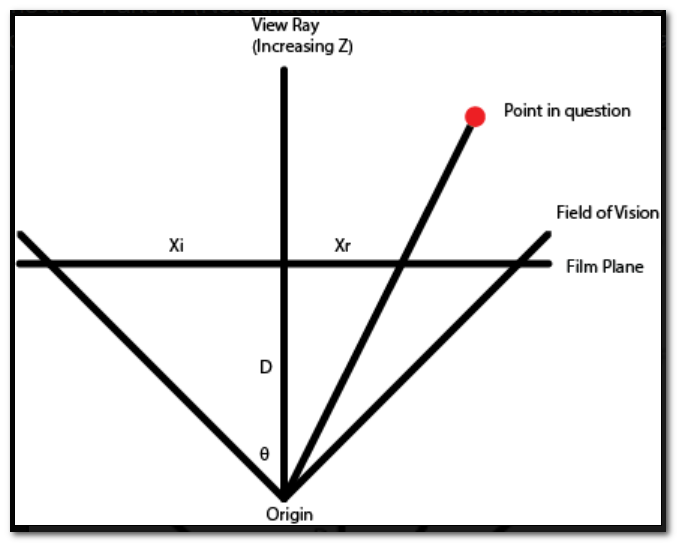

# Deriving projection matrices

[Source Page](http://litherum.blogspot.com/2015/05/deriving-projection-matrices.html)

There are many transformations which points go through when they flow through the 3D pipeline . Points are transformed from local space to world space , from world space to camera space , and from camera space to clip space , performed by the model , view and projection matrices , respectively . The idea here is pretty straightforward - your points are in some arbitrary coordinate system , but the 3D engine only understands in one particular coordinate system (called Normalized Device Coordinates).

The concept of a coordinate system should be straightforward . A coordinate system is one example of a "vector space", where there are some number of bases , and points inside the vector space are represented as linear combinations of the bases . One particular spacial coordinate system has bases of (a vector pointing to the right , a vector pointing up , and a vector pointing outward).

However , that is just one example of a coordinate system . There are (infinitely) many coordinate systems which all represent the same space . When some collection of bases span a space , it means that any point in that space can be described as the sum of scalar functions of these bases . Which means that there is a particular coordinate system that spans 3D space which has its origin at my eyeball , and there is another coordinate system which spans the same space , but its origin is a foot in front of me . Because both of these coordinate systems span 3D space , any point in 3D space can be written in terms of either of these bases .

which means , given a point in one coordinate system , it is possible to find what that point would be if written in another coordinate system . This means that we're taking one coordinate system , and transforming it somehow to turn it into another coordinate system . If you think of it like graph theory , coordinate systems are like nodes and transformations are like edges , where the transformations get you from one coordinate system to another .

Linear transformations are represented by matrices , because matrices can represent all linear transformations . Note that not all coordinate systems are linear - it is straightforward to think of a coordinate system where , as you travel down an axis , the points you encounter do not have linearly growing components . (Color spaces , in particular , have this characteristic). However , when dealing with space , we can still span the entire vector space by using linear bases , so there is no need for anything more elaborate . Therefore , everything is linear , which means that our points are represented as simply dot products with the bases , This also means that transformations between coordinate systems can be characterized by matrices , and all linear transformations have a representative matrix .

Another benefit of matrices if that you can join two matrix tranformations together into a single matrix transformation(which represents the concatenation of the two individual transformations) by simply multiplying the matrices . Therefore , we can run a point through a chain of transformation matrices for free , by simply multiplying all the matrices together ahead of time .

When an artist models some object , he/she will do it in a local coordinate system . In order to place the object in a world , that local coordinate system needs to be transformed there . Therefore , a transformation matrix (called the Model matrix) is created which represents the transformation from the local coordinate system to the world coordinate system , and then the points in the model are transformed (multiplied) by this matrix , If you want to move the object around in 3D space , we just modify the transformation matrix , and keep everything else the same . The resulting multiplied points will just work accordingly .

However , the pixels that end up getting drawn on the screen are relative to some camera , so we need to then tranform our points in world space into camera space . This is done by multiplying with the View matrix . It is the same concept as the Model matrix , but we're just putting points in the coordinate system of the camera . If the camera moves around , we update the View matrix , and leave everything else the same .

As an aside , our 3D engine only understands points in a [-1, 1] range (it will scale up these resulting points to the size of the screen as a last step) which means that your program doesn't have to worry about the resolution of the screen . This requirement is pretty straightforward to satisfy - simply multiply by a third matrix , called the Projection matrix , which just scales by something which will renormalize the points into this target range . So far so good .

Now , the end goal is to transform our points such that the X and Y coordinates of the end-result points represent the locations of the pixels which to light up , and the Z coordinate of the end-result point represents a depth value for how deep that point is . This depth value is useful for making sure we only draw the closest point if there are a few candidates which all end up on the same (X, Y) coordinate on the screen . Now , if the coordinate system that we have just created (by multiplying the Model, View and Projection matrices) satisfies this requirement , then we can just be done now . This is what is known as an "orthographic projection" , where points that are deeper away aren't drawn in to the center of the screen by perspective . And that's fine .

However , if we're trying model people's field of view , it gets wider the farther out from the viewer we get , like in this top-down picture . (Note that from here on out , I'm going to disregard the Y dimension so I can draw pictures . The Y dimensions is conceptually the same as the 
x dimension) So , what we really want are all the points in rays from the origin to have the same X coordinate .

Let's consider , like a camera , that there is a "film" plane orthogonal to the view vector . What we are really trying to find is distance along this plane , normalized so that the edges of the plane are -1 and 1 . (Note that this is a different model the simple [-1, 1] scaling we were doing with the orthographic projection matrix , so don't do that simple scaling here . We'll take care of it later .)



Let's call the point we're considering P = (X<sub>0</sub> , Z<sub>0</sub>) . All the points that will end up with the same screen coordinates as P will lie along a ray . We can describe this ray with a parametric equation P<sub>all</sub>(t) = t * (X<sub>0</sub> , Z<sub>0</sub>) . If we consider the intersection that this ray has with the film plane at a particular depth D , we can find what we are looking for .

$$
t * Z_{0} = D \\
t = D / Z_{0} \\
Xr = t * X_{0} \\
Xr = D / Z_{0} * X_{0} = (D * X_{0}) / Z_{0}
$$

We then want to normalize to make sure that the rays on the edge of the field of vision map to -1 and 1 . We know that

$$
\tan(\theta) = Xi / D \\
Xi = tan(\theta) * D
$$

We want to calculate

$$
s = Xr / Xi \\
s = ((D * X_{0}) / Z_{0}) / (\tan(\theta) * D) \\
s = (X_{0} / Z_{0}) / \tan(\theta) \\
s = X_{0} * \cot(\theta) / Z_{0}
$$

This last line really should be written as

$$
s(X_{0}, Z_{0}) = X_{0} * \cot(\theta) / Z_{0}
$$

to illustrate that we are computing a formula for which resulting pixel gets lit up on our screen (in the x dimension) , and that the result is sensitive to the input point .

Note that this resulting coordinate space is called Normalized Device Coordinates . (Normalized because it goes from -1 to 1)

This result should make sense - the Ds cancel out because it doesn't matter how far the file plane is , the rays' horizontal distance is all proportional to the field of view . Also , as $X_{0}$ increases , so does our scalar , which means as points move to the right , they will move to the right on our screen . As $Z_{0}$ increases (points get farther away) , it makes sense that they should move closer to the view ray (but never cross it) . Because our coordinate system puts -1 at the left edge of the screen and 1 at the right edge , dividing a point by its Z value makes sense - it moves the point toward the center of the screen , by an amount which grows the farther the point is away , which is what you would expect .

However , it would be really great if we could represent this formula in matrix notation , so that we can insert it in to our existing matrix multiplication pipeline (Model matrix * View matrix * Projection matrix) . However , that "/ $Z_{0}$" in the formula is very troublesome , because it can't be represented by a matrix . So what do we do ?

Well , we can put as much into matrix form as possible , and then do that division at the very end . This makes our transformation pipeline look like this :

```
(A matrix representing some piece of projection * (View matrix * (Model matrix * point))) / Z0
```

Let's call that matrix representing some piece of projection , the Projection matrix . 

Because of the associative property of matrix multiplication , we can rewrite our pipeline to look like this :

```
(Projection matrix * View matrix * Model matrix) * point / Z0
```