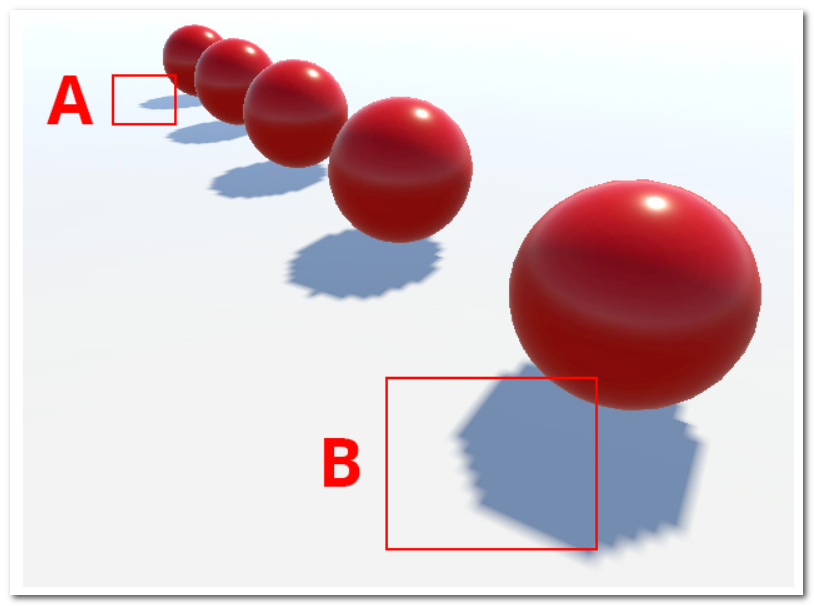
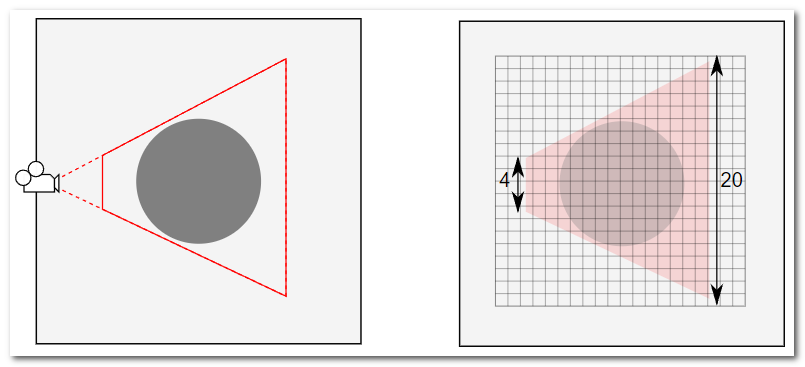
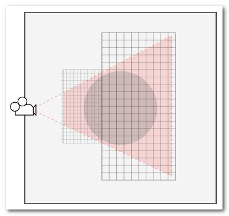
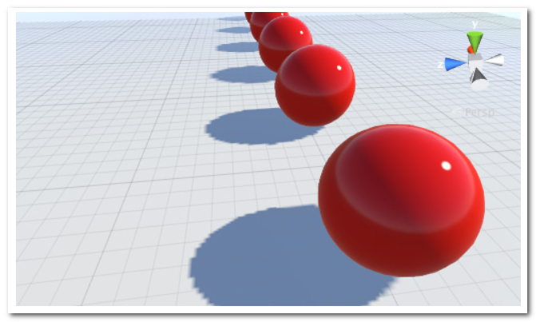

# Shadow Cascades

[Source Page](https://docs.unity3d.com/2020.3/Documentation/Manual/shadow-cascades.html)

Shadow Cascades help solve a problem called perspective aliasing , where real-time shadows from Directional Lights appear pixelated when they are near the Camera .

Shadow Cascades only work with Directional Lights .

## Perspective aliasing

A Directional Light typically simulates sunlight , and a single Directional Light can illuminate the entire Scene . This means that its shadow map covers a large portion of the Scene , which can lead to a problem called perpective aliasing . Perspective aliasing means that shadow map pixels close to the Camera look enlarged and chunky compared to those farther away .

Perspective aliasing occurs because different areas of the shadow map are scaled disproportionately by the Camera's perspective . The shadow map from a light needs to cover only the part of the Scene visible to the Camera , which is defined by the Camera's view frustum . If you Imagine a simple case where the directional light comes directly from above , you can see the relationship between the frustum and the shadow map .

In this simplified example , the distant end of the frustum is covered by 20 pixels of shadow map , while the near end is covered by only 4 pixels , However , both ends appear the same size on-screen . The result is that the resolution of the map is effectively much less for shadow areas that are close to Camera .

## How Shadow Cascades work

Perspective aliasing is less noticeable when you use Soft Shadows , and when you use a higher resolution for the shadow map . However , these solutions use more memory and bandwitdh while rendering .

When using Shadow Cascades , Unity splits the frustum area into two zones based on distance from the Camera . The zone at the near end uses a separate shadow map at a reduced size(but with the same resolution). These staged reductions in shadow map size are known as cascaded shadow maps(sometimes called Parallel Split Shadow Maps).

## Using Shadow Cascades

When you configure Shadow Cascades in your Project , you can choose use 0 , 2 or 4 cascades . Unity calculates the positioning of the cascades withing the Camera's frustum .

The more cascades you use , the less your shadows are affected by perspective aliasing . Increasing the number increases the rendering overhead . However , this overhead is still less than it would be if you were to use a high resolution map across the whole shadow .

