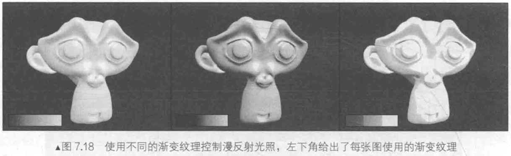

# 渐变纹理

2020.4.8(3)

在一开始 , 我们在渲染中使用纹理是为了定义一个物体的颜色 , 但后来人们发现 , 纹理其实可以用于存储任何表面属性 . 一种常见的用法就是**使用渐变纹理来控制漫反射光照的结果** .

在之前计算漫反射光照时 , 我们使用表面法线和光照方向的点积结果与材质的反射率相乘来得到表面的漫反射光照 . 但有时 , 我们需要更加灵活地控制光照结果 . 这种技术在游戏 < 军团要塞2 > 中流行起来 , 它也是由 Valve 公司提出来的 , 他们使用这种技术来渲染游戏中具有插画风格的角色 .

这种技术最初由 Gooch 等人在 1998 年他们发表的一篇著名的论文 < A Non-Photorealistic Lighting Model For Automatic Technical Illustration > 中被提出 . 在这篇论文中 , 作者提出了一种基于**冷到暖色调**的着色技术 , 用来得到一种插画风格的渲染效果 . 使用这种技术 , 可以保证物体的轮廓线相比于之前使用的传统漫反射光照更加明显 , 而且能够提供多种色调变化 . 而现在 , 很多卡通风格的渲染中都使用了这种技术 .

在本节 , 我们将学习如何使用一张渐变纹理来控制漫反射光照 . 在学习完本节后 , 我们可以得到类似下图的效果 .

可以看出 , 使用这种方式可以自由地控制物体的漫反射光照 . 不同的渐变纹理有不同的特性 .
